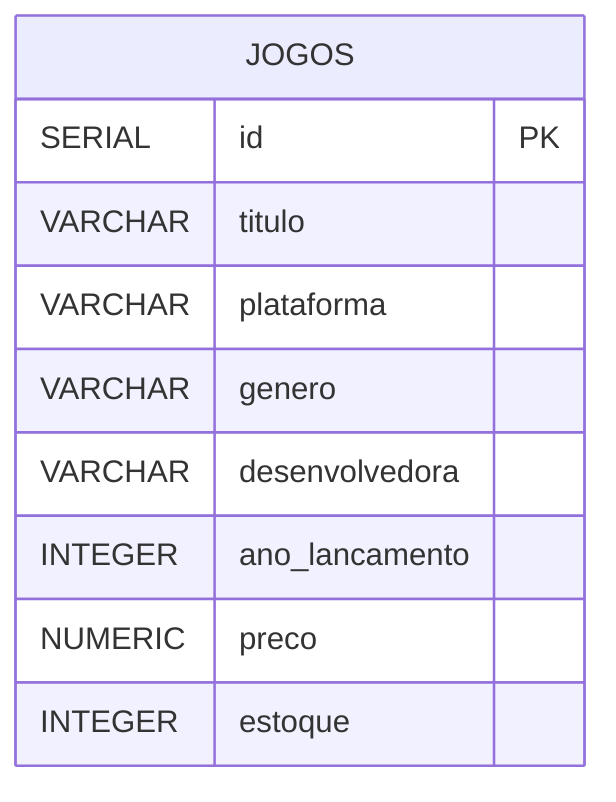
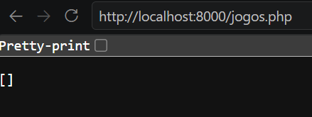
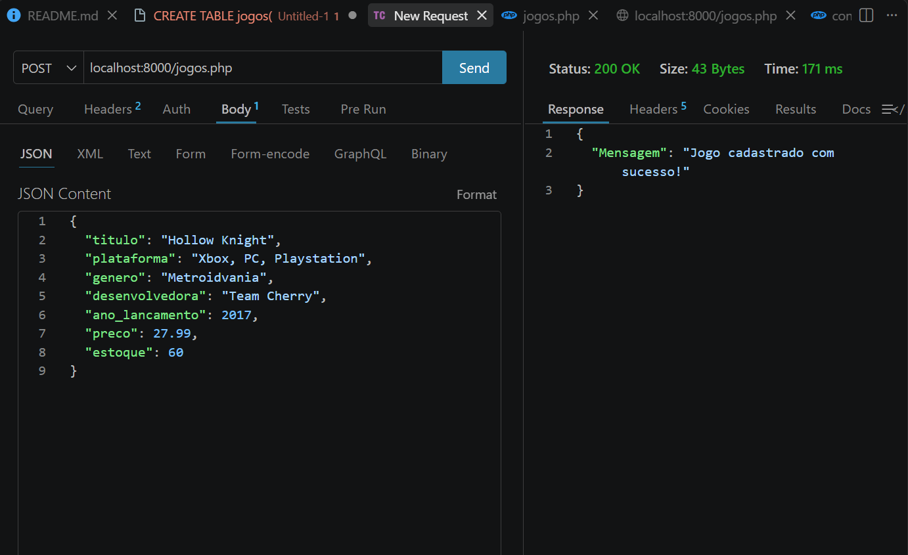
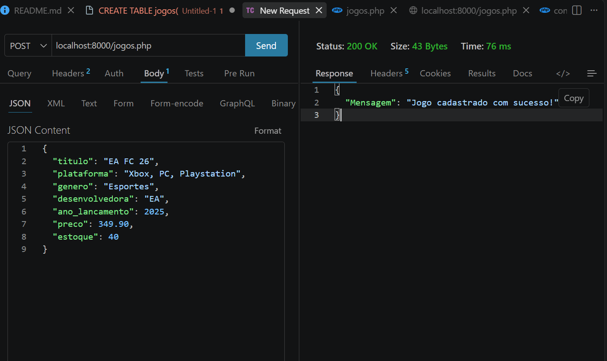
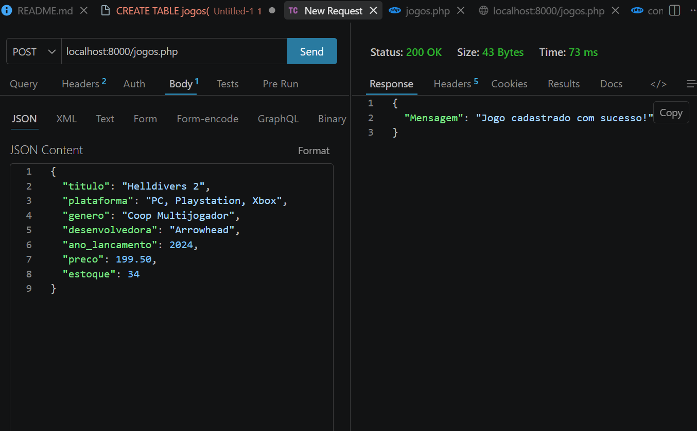
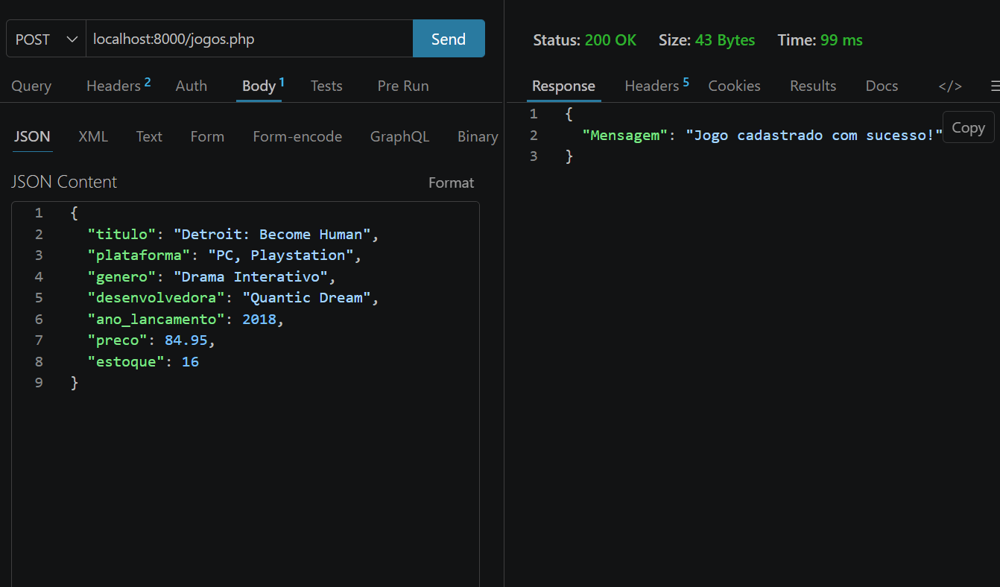
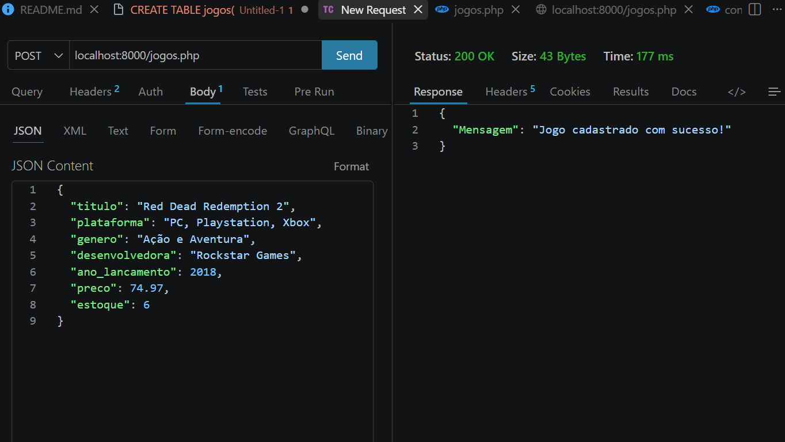
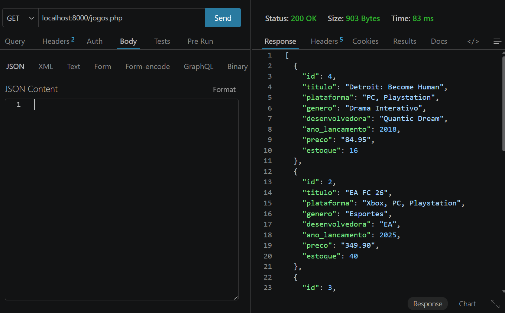

# 🎮 LevelUp - API de Catálogo de Jogos

API para cadastro e consulta de Database de uma loja de jogos fictícia, feita utilizando as seguintes linguagens e tecnologias:


---

## 📑 Sumário

- [Modelo de dados](#-modelo-de-dados)
- [1. Criando o banco de dados](#1-️-criando-o-banco-de-dados)
- [2. Adicionando os jogos](#2--adicionando-os-jogos)
- [3. Visualizando os jogos](#3--visualizando-os-jogos)
- [4. Como rodar o projeto](#-como-rodar)


---

## 🗺️ Modelo de dados



---

## 1. 🛠️ Criando o banco de dados

Criamos a database com o comando:

```sql
CREATE DATABASE levelup;
```

Depois, criamos a tabela `jogos`:

```sql
CREATE TABLE jogos (
    id SERIAL PRIMARY KEY,
    titulo VARCHAR(50) NOT NULL,
    plataforma VARCHAR(50) NOT NULL,
    genero VARCHAR(50) NOT NULL,
    desenvolvedora VARCHAR(50) NOT NULL,
    ano_lancamento INTEGER NOT NULL,
    preco NUMERIC(10,2) NOT NULL,
    estoque INTEGER NOT NULL
);
```

---

## 2. ➕ Adicionando os jogos

Após o código estar pronto e rodando no servidor `localhost`, já podemos adicionar e visualizar nossos jogos. Olhando para o servidor agora, vemos que ele está vazio:

<p align="center">
  
</p>

Agora vamos adicionar os jogos usando o **Thunder Client**, enviando cada jogo via `POST` no seguinte formato JSON:

```json
{
  "titulo": "Nome do Jogo",
  "plataforma": "Plataforma",
  "genero": "Genero do Jogo",
  "desenvolvedora": "Nome da Desenvolvedora",
  "ano_lancamento": 0000,
  "preco": 00.00,
  "estoque": 0
}
```

### Jogos cadastrados

| # | Jogo | Print |
|---|------|-------|
| 1º | Hollow Knight | [`assets/02-post-hollow-knight.png`](./assets/02-post-hollow-knight.png) |
| 2º | EA FC 26 | [`assets/03-post-ea-fc-26.png`](./assets/03-post-ea-fc-26.png) |
| 3º | Helldivers 2 | [`assets/04-post-helldivers-2.png`](./assets/04-post-helldivers-2.png) |
| 4º | Detroit: Become Human | [`assets/05-post-detroit-become-human.png`](./assets/05-post-detroit-become-human.png) |
| 5º | Red Dead Redemption 2 | [`assets/06-post-red-dead-redemption-2.png`](./assets/06-post-red-dead-redemption-2.png) |

<p align="center">
  <br>
  <em>1º jogo adicionado — Hollow Knight</em>
</p>

<p align="center">
  <br>
  <em>2º jogo adicionado — EA FC 26</em>
</p>

<p align="center">
  <br>
  <em>3º jogo adicionado — Helldivers 2</em>
</p>

<p align="center">
  <br>
  <em>4º jogo adicionado — Detroit: Become Human</em>
</p>

<p align="center">
  <br>
  <em>5º jogo adicionado — Red Dead Redemption 2</em>
</p>

---

## 3. 📋 Visualizando os jogos

Usando `GET` pelo Thunder Client, conseguimos ver todos os jogos cadastrados, ordenados alfabeticamente pelos seus títulos:

<p align="center">
  
</p>

O JSON final retornado pelo `GET` fica assim:

```json
[
  {
    "id": 4,
    "titulo": "Detroit: Become Human",
    "plataforma": "PC, Playstation",
    "genero": "Drama Interativo",
    "desenvolvedora": "Quantic Dream",
    "ano_lancamento": 2018,
    "preco": "84.95",
    "estoque": 16
  },
  {
    "id": 2,
    "titulo": "EA FC 26",
    "plataforma": "Xbox, PC, Playstation",
    "genero": "Esportes",
    "desenvolvedora": "EA",
    "ano_lancamento": 2025,
    "preco": "349.90",
    "estoque": 40
  },
  {
    "id": 3,
    "titulo": "Helldivers 2",
    "plataforma": "PC, Playstation, Xbox",
    "genero": "Coop Multijogador",
    "desenvolvedora": "Arrowhead",
    "ano_lancamento": 2024,
    "preco": "199.50",
    "estoque": 34
  },
  {
    "id": 1,
    "titulo": "Hollow Knight",
    "plataforma": "Xbox, PC, Playstation",
    "genero": "Metroidvania",
    "desenvolvedora": "Team Cherry",
    "ano_lancamento": 2017,
    "preco": "27.99",
    "estoque": 60
  },
  {
    "id": 5,
    "titulo": "Red Dead Redemption 2",
    "plataforma": "PC, Playstation, Xbox",
    "genero": "Ação e Aventura",
    "desenvolvedora": "Rockstar Games",
    "ano_lancamento": 2018,
    "preco": "74.97",
    "estoque": 6
  }
]
```

---

## 🖥️ Como rodar

Para rodar o código, um arquivo está faltando nesse repositório, sendo ele o `conexao.php` (por razões óbvias de segurança). Portanto ele deve ser criado com o seguinte código:

```php
<?php 

$host = "000.000.00.00"; // Coloque o IP do servidor aqui
$usuario = "usuario"; // Coloque o nome de usuário onde o banco de dados está. Por exemplo: postgres
$banco = "levelup"; // O nome da database, no nosso caso levelup
$senha = "senha"; // A senha do usuário

$pdo = new PDO (
    "pgsql:host=$host;port=5432;dbname=$banco",
    $usuario,
    $senha
);
```

## ⚠️ OBSERVAÇÃO IMPORTANTE:

Quando o servidor for iniciado, não há um arquivo index.php. Portanto precisamos indicar o caminho correto corrigindo qual arquivo queremos acessar. No nosso caso:
`localhost:8000/jogos.php`
Isso também vale para o endereço inserido no Thunder Client.

Alternativamente, clique [aqui](localhost:8000/jogos.php).